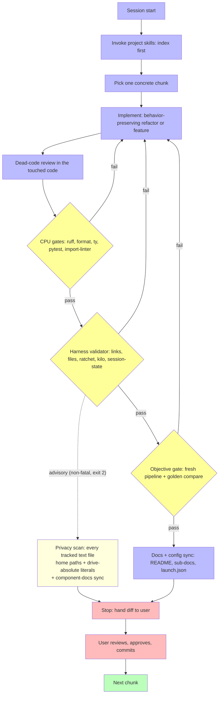
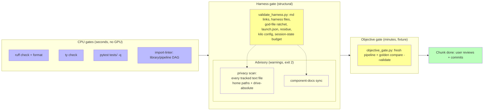

# 6 — AI-Agent Harness

One-line purpose: how the AI agent is harnessed in this repository — the rules, skills, gates, and verification loop that make its work reliable and auditable. Companion of [AGENTS.md](../AGENTS.md) (the authoritative rule source, loaded every session).

## What the harness is

The **harness** is the control layer around the AI agent: **Agent = Model + Harness**. The model generates responses; the harness provides the rules, tools, gates, and protocols that keep the composite reliable, traceable, and verifiable. In this repository the harness is:

| Component | Files | Role |
| :-- | :-- | :-- |
| Standing context | [AGENTS.md](../AGENTS.md) | Objective, toolchain, working rules, fallback policy, quality gates — loaded every session |
| Skills | `.kilo/skills/<name>/SKILL.md` | Reusable workflows invoked at need: [refactor-to-objective](../.kilo/skills/refactor-to-objective/SKILL.md), [keep-docs-navigable](../.kilo/skills/keep-docs-navigable/SKILL.md) |
| Commands | `.kilo/command/refactor-loop.md` | `/refactor-loop` — starts a goal-driven chunk session |
| Feature protocol | [.kilo/FEATURE_WORKFLOW.md](../.kilo/FEATURE_WORKFLOW.md) | Feature-request intake → design doc → gates → PR checklist |
| Permissions | `kilo.json` | Tool permission gates (uv/python/lint/test/git read-only) |
| Structural validator | [scripts/validate_harness.py](../scripts/validate_harness.py) + [scripts/privacy_scan.py](../scripts/privacy_scan.py) | Deterministic harness checks (below) + the advisory privacy scan (its own module) |
| Objective gate | [scripts/objective_gate.py](../scripts/objective_gate.py) + [scripts/golden_snapshot.py](../scripts/golden_snapshot.py) | Behavior verification (fresh pipeline + golden snapshot) |

Local/personal state under `.kilo/` (Agent Manager sessions, worktrees, scratch) is excluded from version control via `.kilo/.gitignore`.

## Work cycle

Each session runs one concrete **chunk** toward the § Objective of AGENTS.md. The cycle is behavior-preserving and golden-gated:

Key properties of the cycle:

- **The user commits, never the agent.** Work stops at the working tree ([AGENTS.md](../AGENTS.md) § Working rule).
- **Runtime fallbacks need explicit user approval** ([AGENTS.md](../AGENTS.md) § Runtime fallback policy); pre-approved exceptions are listed there and must be observable in logs.
- **Fresh verification is non-negotiable:** stages are resumable, so only a wiped `DARD_test` proves a chunk ([AGENTS.md](../AGENTS.md) § Objective verification). GPU inference is non-deterministic; the golden gate tolerates drift and hard-fails only on regressions.

## Verification layers

Every gate is a runnable command with a deterministic exit code; every failure message states the remediation (remediation-injecting errors). A green `pytest` alone never substitutes the objective gate.

### The structural validator (`scripts/validate_harness.py`)

Turns judgment-only rules into mechanical checks:

- **Markdown links resolve** in README.md and `docs/*.md` (keep-docs-navigable rule 3).
- **Harness files exist**: `AGENTS.md`, `kilo.json`, `docs/6-HARNESS.md`, `docs/HARNESS_RULES.md`, `scripts/cycle_metrics.py`, `scripts/privacy_scan.py`, `.kilo/` skills/commands, `.kilo/.gitignore` exclusions.
- **Skill references**: skills named in AGENTS.md exist in `.kilo/skills/`.
- **No Claude/Copilot residue**: the retired harnesses stay removed.
- **God-file ratchet**: tracked `.py` files must not exceed 600 lines; files in `GOD_FILE_BASELINES` must not grow from their recorded size. The ratchet is user-owned — the agent never raises a baseline.
- **launch.json paths exist**: debug configurations match `pipeline/` + `scripts/` reality.
- **kilo.json parses / local-state exclusions**: `.kilo/.gitignore` keeps agent-manager state out of git.
- **Session-state budget**: `MEMORY.md` stays under 40 KB (fatal over budget; advisory at ≥ 80%).

Advisory checks (warnings — never fatal; exit 2, hooks must accept 2):

- **Privacy scan**: machine-local path patterns across **every tracked text file** — scope comes from `git ls-files`, so `tests/*.py`, `configs/*.yaml`, and scripts are inspected, not only README/docs. Three classes: home-directory paths (any `home/<name>` or `<drive>:/Users/<name>` form, synthetic names allowlisted), **any drive-absolute literal** that is not a documented example root / vendor install dir / placeholder / fixture token, and **unscannable text files** (a text-suffixed file that is not UTF-8/UTF-16, or whose bytes stay unreadable — reported rather than silently passed). The repo is public; each hit is reviewed by the user, never auto-edited. Residual gap (honest): binary formats and Office/PNG author metadata are out of scope by design.
- **Component-docs sync**: every `pipeline/*.py` stage script must be named in `.vscode/launch.json` or README/docs (undocumented components mask their own future evolution).

Exit-code contract (stable — hooks depend on it): `0` = clean, `2` = warnings only, `1` = errors. `--check` runs quietly for the pre-commit hook (errors to stderr).

Wired as the `validate-harness` pre-commit hook. Run directly with `uv run python scripts/validate_harness.py`.

## Rule provenance

Rules in [AGENTS.md](../AGENTS.md) are adopted keyed by the failure that motivated them (the rule text cites the incident or pins it to a test, e.g. config-dir-relative regressions are pinned by `tests/test_run_pipeline_progressive.py::test_resolve_config_path_*`). When a session adopts a new rule, the motivating failure is stated in the rule text in the same chunk — a rule without a motivating failure is aspirational and does not get adopted. The `harness-self-improve`-style audit (contradictory, obsolete, or duplicated rules) is part of the documentation gate: every chunk reviews `.kilo/` references and this document when the harness changes.